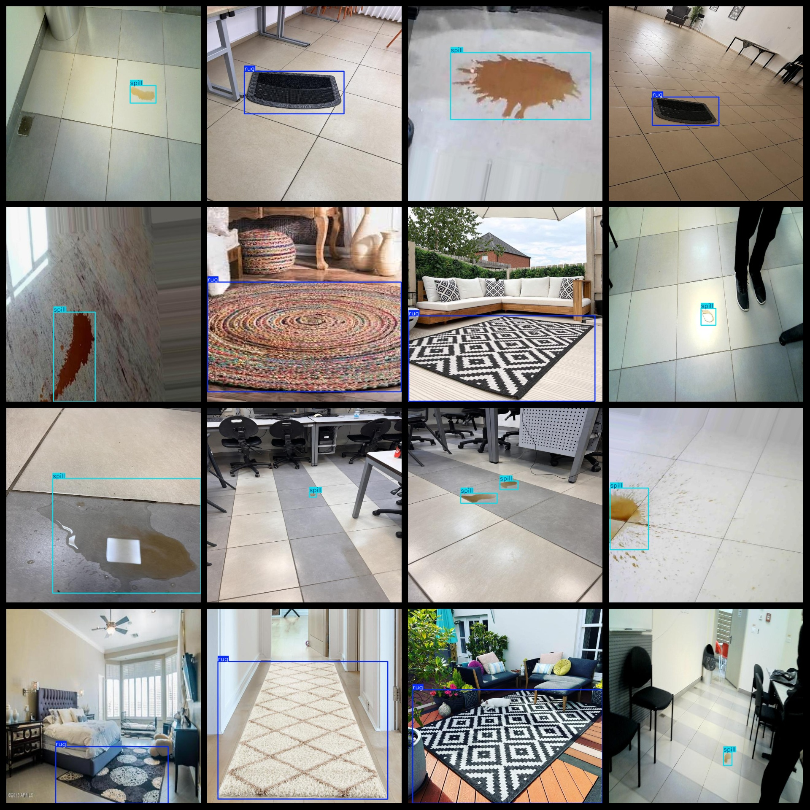

# This dataset contains 847 images of ground water stain detection. It is a combination of the VOC+ and YOLO datasets, with additional images for training purposes. The dataset is available in both VOC format and YOLO format, making it easy to use for different machine learning models.

Ground Water Stain Detection Dataset: 847 images, VOC+YOLO format (excluding the segmentation path in the txt file, only including jpg images and corresponding VOC-formatted xml files and yolo-formatted txt files).

Number of Images (jpg file count): 847

Number of Annotations (xml file count): 847

Number of Annotations (txt file count): 847

Number of Label Categories: 2

GitHub repository: datasets_sl

Label Category Names (Note that the order of labels in the yolo format is not consistent with this, but refer to the "labels" folder's "classes.txt" for consistency): ["rug", "spill"]

Number of Boxes per Category:

- rug boxes = 412
- spill boxes = 505
Total boxes = 917

Number of Images per Category:

- rug images = 398
- spill images = 453
Image resolution: 640x640

Annotation tool used: labelImg

Dataset enhancement status: No

Annotation rules: Draw a box around the category

Important Note: The dataset does not have been split into training, validation, and test sets, so you need to do it yourself.

Special Remark: This dataset does not guarantee the accuracy of the trained model or weights files.

Assessment and image details are as follows:

## Images

---

Here is a pay link on Stripe (https://buy.stripe.com/3cs8yP7sY87d0vu9AB). Please contact me lonlonago@foxmail.com after funding $89, and I will send you a complete data files, thank you!

